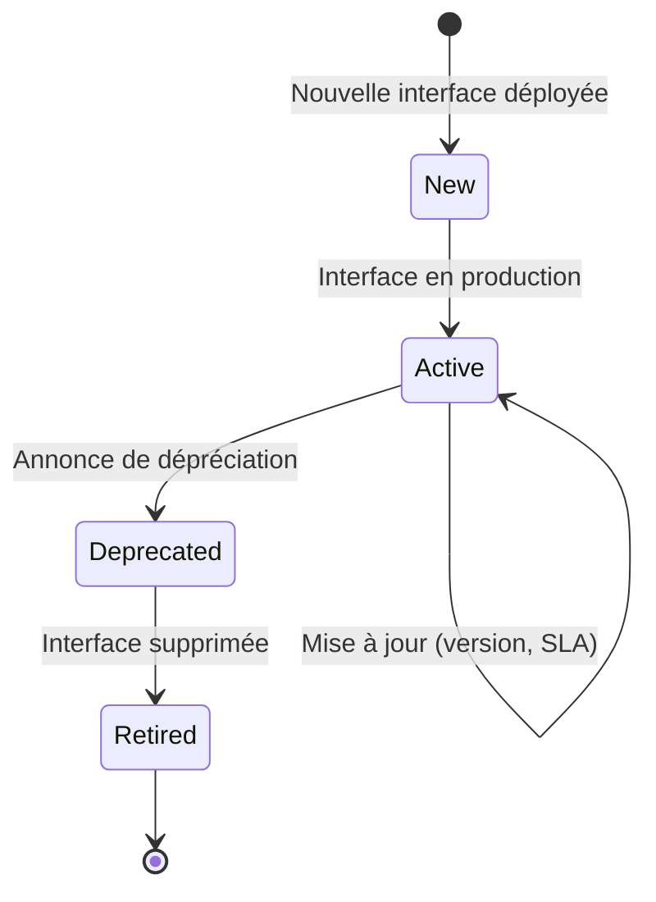
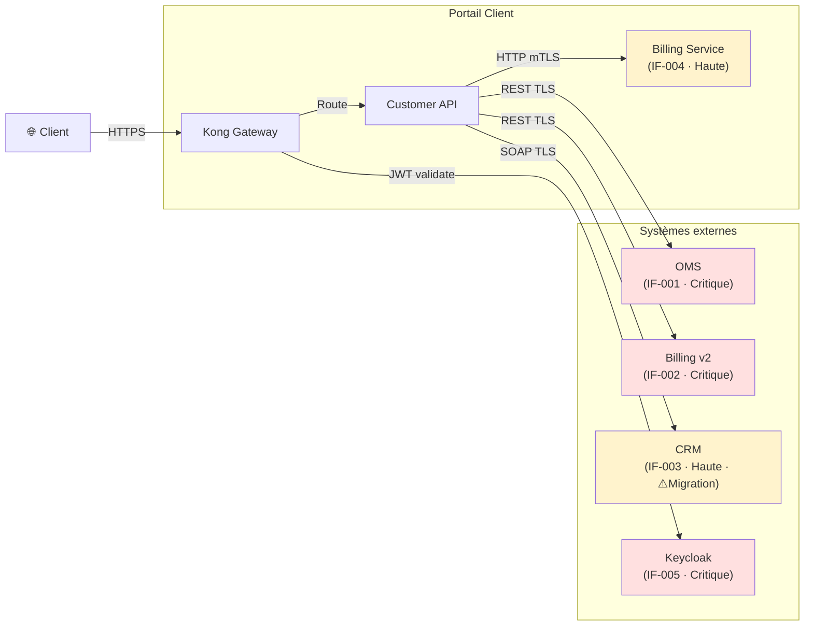

# Catalogue des Interfaces

> 📁 Phase : ⑤ Operations / Risk / Safety · 🏷️ Acronyme : **CI** · 🔤 EN : _Interface Catalogue / Service Catalogue_

---

## 1. Définition & objectif

Le **Catalogue des Interfaces** est un **inventaire centralisé de toutes les interfaces actives en production** entre les systèmes, services et composants : endpoints, protocoles, versions, SLA, propriétaires et statuts. Il répond à « **Quelles interfaces existent en production, entre qui, avec quels contrats, et qui en est responsable ?** »

À distinguer des **ICD** (Lot 2) qui sont les _spécifications contractuelles_ d'une interface : le Catalogue des Interfaces est la _carte opérationnelle_ — qui est branché sur quoi, en production, maintenant.

| Ce qu'il EST                              | Ce qu'il N'EST PAS                    |
| ----------------------------------------- | ------------------------------------- |
| L'inventaire opérationnel des interfaces  | Un ICD (spécification de l'interface) |
| La vue "production" des connexions        | Un diagramme C4 (vue architecturale)  |
| Un outil de gouvernance et de traçabilité | Une liste de dépendances applicatives |

---

## 2. Usage & utilité

- **Gouvernance** : qui dépend de qui ? Quelle interface peut être modifiée sans casser quelqu'un d'autre ?
- **Analyse d'impact** : avant de modifier un service, identifier tous ses consommateurs.
- **Incident** : « Le système CRM est en panne — quels services en dépendent ? »
- **Décommission** : identifier les consommateurs d'un service avant de le retirer.
- **Sécurité** : inventaire des surfaces d'exposition réseau (flux entrants/sortants).
- **Audit** : preuve que les flux sont maîtrisés (conformité, DORA, ISO 27001).

---

## 3. Périmètre (in / out of scope)

**In scope**

- Interfaces actives en production (et staging si pertinent).
- Pour chaque interface : producteur, consommateur, protocole, endpoint, version, SLA, propriétaire.
- Statut (active, dépréciée, remplacée).
- Sécurité (authentification, chiffrement).
- Lien vers le SLA/SLO et l'ICD associé.

**Out of scope**

- Spécification détaillée → **ICD / API Spec**.
- Interfaces internes à un seul service (privées).
- Dépendances de bibliothèques → **SBOM**.

---

## 4. Cycle de vie du document



- **Naissance** : créé ou mis à jour à chaque déploiement d'une nouvelle interface.
- **Vie** : **document vivant** — idéalement généré automatiquement via le Service Mesh ou l'API Gateway.
- **Fin** : interface retirée → entrée archivée avec date et raison.

---

## 5. Métiers / rôles concernés (RACI)

| Activité                              | Dev / Tech Lead | SRE / DevOps | Architecte | SecOps |
| ------------------------------------- | :-------------: | :----------: | :--------: | :----: |
| Enregistrement (nouvelles interfaces) |      **R**      |      C       |     C      |   I    |
| Validation & mise à jour              |        C        |    **R**     |   **R**    |   C    |
| Revue de gouvernance                  |        C        |      C       |   **R**    | **R**  |
| Analyse d'impact (changement)         |      **R**      |      C       |   **R**    |   C    |

---

## 6. Position & interactions avec les autres documents

```mermaid
flowchart LR
    ICD[ICD Lot 2] --> CI[Catalogue Interfaces]
    API[API Spec] --> CI
    C4[C4 L2] -.cohérence.-> CI
    CI -.alimente.-> TM[Threat Model\n(surface d'attaque)]
    CI -.alimente.-> FMEA[FMEA\n(dépendances critiques)]
    CI -.alimente.-> DRP[DRP/PCA\n(interfaces à rétablir en priorité)]
    CI -.dépréciation.-> NOTIF[Notification consommateurs]
```

| Document         | Relation                                                                                  |
| ---------------- | ----------------------------------------------------------------------------------------- |
| **ICD**          | Chaque entrée du catalogue pointe vers l'ICD de référence.                                |
| **C4 L2**        | Le C4 est la vue architecturale ; le catalogue est la vue opérationnelle (en production). |
| **Threat Model** | Le catalogue liste les surfaces d'exposition réseau.                                      |
| **DRP/PCA**      | Les interfaces critiques sont celles à rétablir en priorité.                              |

---

## 7. Nommage & versionnement

- **Fichier** : `catalogue-des-interfaces.md` ou dans un outil dédié (Backstage, Confluence).
- **Identifiants** : `IF-###` — stables.
- **Automatisation recommandée** : générer depuis le Service Mesh (Istio, Linkerd), l'API Gateway (Kong), ou un Service Registry.

---

## 8. Template vierge

```markdown
# Catalogue des Interfaces — <Système / Organisation>

_Dernière mise à jour : AAAA-MM-JJ_

## IF-### : <Nom court de l'interface>

| Champ                  | Valeur                                  |
| ---------------------- | --------------------------------------- |
| ID                     | IF-###                                  |
| Nom                    | <court, lisible>                        |
| Producteur             | <service/équipe>                        |
| Consommateur(s)        | <liste>                                 |
| Protocole              | HTTP/REST / gRPC / AMQP / SOAP / ...    |
| Endpoint               | `https://...` ou `queue://...`          |
| Version API            | v1 / v2                                 |
| Authentification       | Bearer JWT / mTLS / API Key / None      |
| Chiffrement            | TLS 1.3 / mTLS / Non chiffré            |
| SLA                    | <lien vers SLA/SLO>                     |
| ICD                    | <lien vers ICD>                         |
| Propriétaire technique | <équipe ou handle>                      |
| Criticité              | Critique / Haute / Normale              |
| Statut                 | Active / Dépréciée (→ IF-###) / Retirée |
| Depuis                 | AAAA-MM-JJ                              |
| Notes                  |                                         |
```

---

## 9. Exemple rempli

```markdown
# Catalogue des Interfaces — Portail Client Self-Service

_Dernière mise à jour : 2026-04-23_

---

## IF-001 : Customer API ↔ OMS (lecture commandes)

| Champ            | Valeur                                                                                        |
| ---------------- | --------------------------------------------------------------------------------------------- |
| Producteur       | OMS (équipe Supply Chain)                                                                     |
| Consommateur     | Customer API (équipe Portail)                                                                 |
| Protocole        | HTTP/REST                                                                                     |
| Endpoint         | `https://oms.internal.example.com/api/v2/`                                                    |
| Version          | v2                                                                                            |
| Authentification | Bearer JWT (service account)                                                                  |
| Chiffrement      | TLS 1.3                                                                                       |
| SLA              | OMS ≥ 99,5%, p95 < 200ms                                                                      |
| ICD              | [ICD-CustomerAPI-OMS-v2.0](../../02-architecture-design/08-icd-interface-control-document.md) |
| Propriétaire     | @team-supply-chain                                                                            |
| Criticité        | **Critique** (page Commandes inaccessible si KO)                                              |
| Statut           | Active depuis 2025-09-01                                                                      |

---

## IF-002 : Customer API ↔ Billing v2 (lecture factures)

| Producteur | Billing v2 (équipe Finance) |
| Consommateur | Customer API |
| Protocole | HTTP/REST |
| Endpoint | `https://billing.internal.example.com/api/v2/` |
| Authentification | Bearer JWT |
| SLA | Billing ≥ 99,5%, p95 < 300ms |
| Criticité | **Critique** |
| Statut | Active depuis 2025-09-01 |

---

## IF-003 : Customer API ↔ CRM (lecture historique)

| Producteur | CRM (équipe Relation Client) |
| Consommateur | Customer API |
| Protocole | SOAP/XML |
| Endpoint | `https://crm.example.com/ws/CustomerHistoryService?wsdl` |
| Authentification | WS-Security (Basic Auth) |
| Chiffrement | TLS 1.2 |
| SLA | CRM ≥ 99%, p95 < 2s |
| Criticité | **Haute** (dégradation gracieuse possible) |
| Statut | Active · ⚠️ Migration vers REST prévue Q3 2026 (TD-001) |

---

## IF-004 : Customer API ↔ Billing Service (génération PDF)

| Producteur | Billing Service (équipe Portail) |
| Consommateur | Customer API |
| Protocole | HTTP/REST interne |
| Endpoint | `http://billing-service:3001/internal/v1/` |
| Authentification | mTLS (réseau interne) |
| Chiffrement | mTLS |
| SLA | p95 génération < 30s |
| ICD | [ICD-CustomerAPI-BillingService-v1.0](../../02-architecture-design/08-icd-interface-control-document.md) |
| Criticité | Haute |
| Statut | Active depuis 2026-03-01 (post RFC-012 / ADR-008) |

---

## IF-005 : Customer API ↔ Keycloak (validation JWT)

| Producteur | Keycloak (IdP) |
| Consommateur | Kong API Gateway |
| Protocole | HTTPS (JWKS endpoint) |
| Authentification | N/A (endpoint public signé) |
| Criticité | **Critique** (100% users déconnectés si KO) |
| Statut | Active · Keycloak HA (2 instances) |

---

## Vue de synthèse — Criticité

| Criticité |           Interfaces           | Action si KO                                   |
| --------- | :----------------------------: | ---------------------------------------------- |
| Critique  | IF-001, IF-002, IF-004, IF-005 | Incident P1 — Playbook PB-portail-inaccessible |
| Haute     |    IF-003, IF-004 (billing)    | Incident P2 — mode dégradé                     |
```

---

## 10. Checklist de revue

- [ ] Toutes les **interfaces en production** sont inventoriées.
- [ ] Chaque interface a un **propriétaire technique** identifié.
- [ ] Le **protocole, endpoint, version et authentification** sont documentés.
- [ ] La **criticité** est évaluée (impact si l'interface tombe en panne).
- [ ] Les interfaces **dépréciées** sont signalées avec leur remplacement.
- [ ] Le catalogue est **synchronisé** avec le C4 L2 et les ICD.
- [ ] Les interfaces critiques sont dans les **Playbooks d'incident**.

---

## 11. Anti-patterns & pièges

| Anti-pattern                                   | Problème                            | Correctif                                       |
| ---------------------------------------------- | ----------------------------------- | ----------------------------------------------- |
| 📋 **Catalogue statique** jamais mis à jour    | Décorrélé de la réalité production  | Automatiser depuis l'API Gateway/Service Mesh   |
| 🕳️ **Interfaces informelles** non inventoriées | Shadow IT, sécurité compromise      | Politque : toute interface → catalogue          |
| 🎭 **Criticité non évaluée**                   | Impossible de prioriser en incident | Évaluer l'impact client de chaque interface KO  |
| 🔒 **Pas de politique de dépréciation**        | Breaking changes non annoncés       | Sunset + délai de migration pour chaque dépréc. |

---

## 12. Variantes par industrie / contexte

| Contexte               | Spécificités                                                         |
| ---------------------- | -------------------------------------------------------------------- |
| **Microservices**      | Service Mesh (Istio/Linkerd) génère le catalogue automatiquement.    |
| **Developer Portal**   | Backstage expose le catalogue avec ownership, SLO et docs.           |
| **ESB / SOA**          | _Service Catalogue_ dans l'ESB (MuleSoft, WSO2).                     |
| **Systèmes critiques** | Catalogue formel des interfaces matériel/logiciel avec ICD associés. |
| **Réglementé (DORA)**  | Inventaire des dépendances ICT tiers exigé.                          |

---

## 13. Standards & normes

- **TOGAF** — _Application Catalogue_ et _Interface Catalogue_ (ADM artifacts).
- **ITIL 4** — _Service Catalogue Management_.
- **DORA EU** — inventaire des actifs ICT et des dépendances tierces.
- **ISO/IEC 20000** — gestion des services et de leur catalogue.

---

## 14. Outillage recommandé

| Besoin                            | Outils                                     |
| --------------------------------- | ------------------------------------------ |
| Developer Portal (catalogue auto) | Backstage (Spotify), Port, Cortex          |
| Service Mesh (auto-discovery)     | Istio, Linkerd, Consul Connect             |
| API Registry                      | Kong (Dev Portal), Apigee, AWS API Gateway |
| Documentation                     | Confluence, Notion, Markdown               |

---

## 15. Diagramme — Vue opérationnelle des interfaces (production)



---

> 🔎 **En une phrase** : le Catalogue des Interfaces est **la carte de toutes les connexions en production** — elle répond à « qui dépend de qui » et permet de mesurer en secondes l'impact d'une panne ou d'un changement.

⬅️ [FMEA](./14-fmea-failure-mode-effects-analysis.md) · 🏠 [Index du lot](./README.md) · 🏠 [Index général](../README.md)
