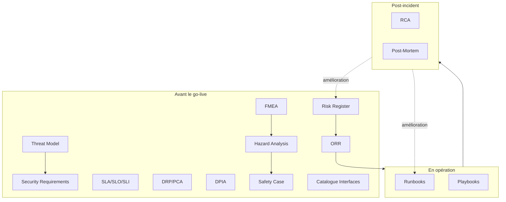

# ⑤ Operations / Risk / Safety

> 📁 Lot 5 · 15 fiches · En cours 🔄

Ce dossier couvre les documents qui **gouvernent l'exploitation, la résilience, la sécurité et la sûreté** du logiciel en production : procédures opérationnelles, gestion des incidents, analyse des risques, conformité et sûreté de fonctionnement. La question centrale : **« Comment fait-on tourner ce système de manière fiable, sécurisée et continue — et comment réagit-on quand ça tourne mal ?** »

---

## Carte du lot

---

## Index des fiches

| #   | Acronyme                     | Nom complet                                    | Question clé                                                                  | Fiche                                               |
| --- | ---------------------------- | ---------------------------------------------- | ----------------------------------------------------------------------------- | --------------------------------------------------- |
| 01  | **Runbook**                  | Runbook                                        | _Comment effectuer cette opération sur le système ?_                          | [→](./01-runbooks.md)                               |
| 02  | **Playbook**                 | Incident Playbook                              | _Comment répondre à cet incident ou scénario de crise ?_                      | [→](./02-playbooks.md)                              |
| 03  | **ORR**                      | Operational Readiness Review                   | _Le système est-il prêt à passer en production ?_                             | [→](./03-orr-operational-readiness-review.md)       |
| 04  | **RCA**                      | Root Cause Analysis                            | _Quelle est la vraie cause de cet incident ?_                                 | [→](./04-rca-root-cause-analysis.md)                |
| 05  | **Post-Mortem**              | Post-Mortem                                    | _Que s'est-il passé, pourquoi, et que faisons-nous pour éviter la récidive ?_ | [→](./05-post-mortem.md)                            |
| 06  | **Risk Register**            | Risk Register                                  | _Quels risques menaçent le projet/produit, et comment les gérons-nous ?_      | [→](./06-risk-register.md)                          |
| 07  | **Threat Model**             | Threat Model                                   | _Qui peut attaquer notre système, comment, et comment s'en protéger ?_        | [→](./07-threat-model.md)                           |
| 08  | **Security Requirements**    | Security Requirements                          | _Quelles exigences de sécurité le système doit-il satisfaire ?_               | [→](./08-security-requirements.md)                  |
| 09  | **Hazard Analysis**          | Hazard Analysis                                | _Quels dangers le système peut-il causer ou subir ?_                          | [→](./09-hazard-analysis.md)                        |
| 10  | **Safety Case**              | Safety Case                                    | _Pourquoi le système est-il suffisamment sûr pour être exploité ?_            | [→](./10-safety-case.md)                            |
| 11  | **SLA/SLO/SLI**              | Service Level Agreements/Objectives/Indicators | _Quels engagements de service prenons-nous et comment les mesurons-nous ?_    | [→](./11-sla-slo-sli.md)                            |
| 12  | **DRP/PCA**                  | Disaster Recovery Plan / Plan de Continuité    | _Comment reprendre le service après un sinistre majeur ?_                     | [→](./12-drp-pca-disaster-recovery.md)              |
| 13  | **DPIA**                     | Data Protection Impact Assessment              | _Quel est l'impact du traitement sur la vie privée des personnes ?_           | [→](./13-dpia-data-protection-impact-assessment.md) |
| 14  | **FMEA**                     | Failure Mode and Effects Analysis              | _Quels modes de défaillance existent et quels sont leurs effets ?_            | [→](./14-fmea-failure-mode-effects-analysis.md)     |
| 15  | **Catalogue des Interfaces** | Catalogue des Interfaces                       | _Quelle est la carte complète des interfaces actives en production ?_         | [→](./15-catalogue-des-interfaces.md)               |

---

## Distinctions clés

|               | **Runbook**                   | **Playbook**                   |
| ------------- | ----------------------------- | ------------------------------ |
| Déclenchement | Opération planifiée ou alerte | Incident / scénario de crise   |
| Audience      | Ops / SRE (on-call)           | Équipe d'incident (tous rôles) |
| Granularité   | Procédure technique précise   | Orchestration multi-étapes     |

|          | **RCA**                    | **Post-Mortem**                           |
| -------- | -------------------------- | ----------------------------------------- |
| Focus    | Causes racines (technique) | Bilan complet (impact + causes + actions) |
| Audience | Équipe technique           | Toutes parties prenantes                  |
| Sortie   | Identification de la cause | Plan d'action et apprentissages           |

|         | **Risk Register**           | **Threat Model**                 | **FMEA**                          |
| ------- | --------------------------- | -------------------------------- | --------------------------------- |
| Domaine | Tous risques projet/produit | Risques de sécurité (attaquants) | Défaillances techniques           |
| Méthode | Probabilité × Impact        | STRIDE / PASTA                   | Sévérité × Occurrence × Détection |

---

⬅️ [Lot 4 : Test / V&V](../04-test-verification-validation/README.md) · 🏠 [Index général](../README.md)
