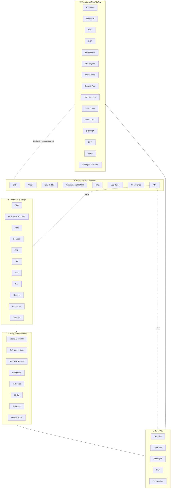
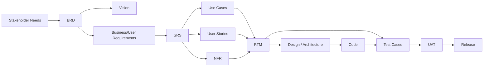

# Easy Engineering

> Un concentré de ressources structurées pour l'ingénierie logicielle, navigable directement depuis GitHub, illustré de schémas [Mermaid](https://mermaid.js.org/).

Ce dépôt documente en profondeur **les artefacts (documents) qui accompagnent le cycle de vie d'un logiciel** : à quoi ils servent, qui les produit, quand, comment ils s'articulent entre eux, et comment les rédiger (template + exemple + checklist).

- **Langue** : contenu en français, terminologie technique conservée en anglais.
- **Approche** : agnostique du domaine, avec des annotations spécifiques par industrie (SaaS/web, systèmes critiques, SI d'entreprise, embarqué…).
- **Ancrage normatif** : références aux standards de référence (IEEE, ISO/IEC/IEEE, BABOK, arc42, C4, TOGAF…).

---

## 🧭 Comment lire ce dépôt

Chaque artefact est décrit dans une **fiche** au format identique (15 sections) pour faciliter la comparaison :

| #   | Section                     | Question à laquelle elle répond              |
| --- | --------------------------- | -------------------------------------------- |
| 1   | Définition & objectif       | _Qu'est-ce que c'est ?_                      |
| 2   | Usage & utilité             | _Pourquoi le produire ?_                     |
| 3   | Périmètre (in/out of scope) | _Que contient-il, que ne contient-il pas ?_  |
| 4   | Cycle de vie du document    | _Quand naît-il, évolue-t-il, meurt-il ?_     |
| 5   | Métiers / rôles (RACI)      | _Qui fait quoi ?_                            |
| 6   | Position & interactions     | _Comment se connecte-t-il aux autres docs ?_ |
| 7   | Nommage & versionnement     | _Comment le nommer et le versionner ?_       |
| 8   | Template vierge             | _Structure à copier-coller._                 |
| 9   | Exemple rempli              | _À quoi ça ressemble en vrai._               |
| 10  | Checklist de revue          | _Comment valider sa qualité ?_               |
| 11  | Anti-patterns & pièges      | _Quelles erreurs éviter ?_                   |
| 12  | Variantes par industrie     | _Comment s'adapte-t-il au contexte ?_        |
| 13  | Standards & normes          | _Sur quoi s'appuyer ?_                       |
| 14  | Outillage recommandé        | _Avec quels outils ?_                        |
| 15  | Diagramme(s) Mermaid        | _Vue synthétique._                           |

---

## 🗺️ Carte globale du cycle de vie documentaire

> Le **RTM** (Requirements Traceability Matrix) est le fil rouge : il relie besoins → exigences → conception → tests. La boucle de **feedback** (post-mortems, RCA) réalimente le backlog et les exigences.

---

## 📚 Table des matières

### ① [Business & Requirements](./01-business-requirements/) — [📋 Index du lot](./01-business-requirements/README.md)

| Doc                                       | Fiche                                                                                                                     | Statut |
| ----------------------------------------- | ------------------------------------------------------------------------------------------------------------------------- | ------ |
| BRD — Business Requirements Document      | [01-brd-business-requirements-document.md](./01-business-requirements/01-brd-business-requirements-document.md)           | ✅     |
| Vision Document                           | [02-vision-document.md](./01-business-requirements/02-vision-document.md)                                                 | ✅     |
| Stakeholder Document                      | [03-stakeholder-document.md](./01-business-requirements/03-stakeholder-document.md)                                       | ✅     |
| Requirements (FR & NFR)                   | [04-requirements-fr-nfr.md](./01-business-requirements/04-requirements-fr-nfr.md)                                         | ✅     |
| SRS — Software Requirements Specification | [05-srs-software-requirements-specification.md](./01-business-requirements/05-srs-software-requirements-specification.md) | ✅     |
| Use Cases                                 | [06-use-cases.md](./01-business-requirements/06-use-cases.md)                                                             | ✅     |
| User Stories                              | [07-user-stories.md](./01-business-requirements/07-user-stories.md)                                                       | ✅     |
| RTM — Requirements Traceability Matrix    | [08-rtm-requirements-traceability-matrix.md](./01-business-requirements/08-rtm-requirements-traceability-matrix.md)       | ✅     |

### ② [Architecture & Design](./02-architecture-design/) — [📋 Index du lot](./02-architecture-design/README.md)

| Doc                                  | Fiche                                                                                                         | Statut |
| ------------------------------------ | ------------------------------------------------------------------------------------------------------------- | ------ |
| RFC — Request for Comments           | [01-rfc-request-for-comments.md](./02-architecture-design/01-rfc-request-for-comments.md)                     | ✅     |
| Architecture Principles              | [02-architecture-principles.md](./02-architecture-design/02-architecture-principles.md)                       | ✅     |
| SAD — Software Architecture Document | [03-sad-software-architecture-document.md](./02-architecture-design/03-sad-software-architecture-document.md) | ✅     |
| C4 Model                             | [04-c4-model.md](./02-architecture-design/04-c4-model.md)                                                     | ✅     |
| ADR — Architecture Decision Record   | [05-adr-architecture-decision-record.md](./02-architecture-design/05-adr-architecture-decision-record.md)     | ✅     |
| HLD — High Level Design              | [06-hld-high-level-design.md](./02-architecture-design/06-hld-high-level-design.md)                           | ✅     |
| LLD — Low Level Design               | [07-lld-low-level-design.md](./02-architecture-design/07-lld-low-level-design.md)                             | ✅     |
| ICD — Interface Control Document     | [08-icd-interface-control-document.md](./02-architecture-design/08-icd-interface-control-document.md)         | ✅     |
| API Specification                    | [09-api-specification.md](./02-architecture-design/09-api-specification.md)                                   | ✅     |
| Data Model                           | [10-data-model.md](./02-architecture-design/10-data-model.md)                                                 | ✅     |
| Glossaire / Ubiquitous Language      | [11-glossaire-ubiquitous-language.md](./02-architecture-design/11-glossaire-ubiquitous-language.md)           | ✅     |

### ③ [Quality & Development](./03-quality-development/) — [📋 Index du lot](./03-quality-development/README.md)

| Doc                                   | Fiche                                                                                                       | Statut |
| ------------------------------------- | ----------------------------------------------------------------------------------------------------------- | ------ |
| Coding Standards                      | [01-coding-standards.md](./03-quality-development/01-coding-standards.md)                                   | ✅     |
| Definition of Done                    | [02-definition-of-done.md](./03-quality-development/02-definition-of-done.md)                               | ✅     |
| Technical Debt Register               | [03-technical-debt-register.md](./03-quality-development/03-technical-debt-register.md)                     | ✅     |
| Design Document                       | [04-design-document.md](./03-quality-development/04-design-document.md)                                     | ✅     |
| AUTH — Authentication & Authorization | [05-auth-authentication-authorization.md](./03-quality-development/05-auth-authentication-authorization.md) | ✅     |
| SBOM — Software Bill of Materials     | [06-sbom-software-bill-of-materials.md](./03-quality-development/06-sbom-software-bill-of-materials.md)     | ✅     |
| Developer Guide / Onboarding Guide    | [07-developer-guide-onboarding.md](./03-quality-development/07-developer-guide-onboarding.md)               | ✅     |
| Release Notes / Changelog             | [08-release-notes-changelog.md](./03-quality-development/08-release-notes-changelog.md)                     | ✅     |

### ④ [Test / V&V](./04-test-verification-validation/) — [📋 Index du lot](./04-test-verification-validation/README.md)

| Doc                           | Fiche                                                                                                    | Statut |
| ----------------------------- | -------------------------------------------------------------------------------------------------------- | ------ |
| Test Plan                     | [01-test-plan.md](./04-test-verification-validation/01-test-plan.md)                                     | ✅     |
| Test Cases                    | [02-test-cases.md](./04-test-verification-validation/02-test-cases.md)                                   | ✅     |
| Test Report                   | [03-test-report.md](./04-test-verification-validation/03-test-report.md)                                 | ✅     |
| UAT — User Acceptance Testing | [04-uat-user-acceptance-testing.md](./04-test-verification-validation/04-uat-user-acceptance-testing.md) | ✅     |
| Performance Baseline          | [05-performance-baseline.md](./04-test-verification-validation/05-performance-baseline.md)               | ✅     |

### ⑤ [Operations / Risk / Safety](./05-operations-risk-safety/) — [📋 Index du lot](./05-operations-risk-safety/README.md)

| Doc                                      | Fiche                                                                                                                    | Statut |
| ---------------------------------------- | ------------------------------------------------------------------------------------------------------------------------ | ------ |
| Runbooks                                 | [01-runbooks.md](./05-operations-risk-safety/01-runbooks.md)                                                             | ✅     |
| Playbooks                                | [02-playbooks.md](./05-operations-risk-safety/02-playbooks.md)                                                           | ✅     |
| ORR — Operational Readiness Review       | [03-orr-operational-readiness-review.md](./05-operations-risk-safety/03-orr-operational-readiness-review.md)             | ✅     |
| RCA — Root Cause Analysis                | [04-rca-root-cause-analysis.md](./05-operations-risk-safety/04-rca-root-cause-analysis.md)                               | ✅     |
| Post-Mortem                              | [05-post-mortem.md](./05-operations-risk-safety/05-post-mortem.md)                                                       | ✅     |
| Risk Register                            | [06-risk-register.md](./05-operations-risk-safety/06-risk-register.md)                                                   | ✅     |
| Threat Model                             | [07-threat-model.md](./05-operations-risk-safety/07-threat-model.md)                                                     | ✅     |
| Security Requirements                    | [08-security-requirements.md](./05-operations-risk-safety/08-security-requirements.md)                                   | ✅     |
| Hazard Analysis                          | [09-hazard-analysis.md](./05-operations-risk-safety/09-hazard-analysis.md)                                               | ✅     |
| Safety Case                              | [10-safety-case.md](./05-operations-risk-safety/10-safety-case.md)                                                       | ✅     |
| SLA / SLO / SLI                          | [11-sla-slo-sli.md](./05-operations-risk-safety/11-sla-slo-sli.md)                                                       | ✅     |
| DRP / PCA — Disaster Recovery            | [12-drp-pca-disaster-recovery.md](./05-operations-risk-safety/12-drp-pca-disaster-recovery.md)                           | ✅     |
| DPIA — Data Protection Impact Assessment | [13-dpia-data-protection-impact-assessment.md](./05-operations-risk-safety/13-dpia-data-protection-impact-assessment.md) | ✅     |
| FMEA — Failure Mode and Effects Analysis | [14-fmea-failure-mode-effects-analysis.md](./05-operations-risk-safety/14-fmea-failure-mode-effects-analysis.md)         | ✅     |
| Catalogue des Interfaces                 | [15-catalogue-des-interfaces.md](./05-operations-risk-safety/15-catalogue-des-interfaces.md)                             | ✅     |

---

## 🔗 Vue des interactions (flux de traçabilité)

---

## 🏷️ Conventions du dépôt

- **Fichiers** : `NN-acronyme-nom-complet.md` en kebab-case (ex. `01-brd-business-requirements-document.md`).
- **Dossiers de lot** : `NN-phase-du-cycle/` avec un `README.md` (index du lot).
- **Fiches longues** : si une fiche dépasse ~400 lignes, elle est scindée en sous-dossier `NN-acronyme/` avec un `README.md` comme point d'entrée et des sections séparées.
- **Diagrammes** : Mermaid inline (rendu natif GitHub) ; pas d'images binaires.
- **Identifiants d'exigences** dans les exemples : `BR-###` (business), `FR-###` (fonctionnel), `NFR-###` (non-fonctionnel), `UC-###`, `US-###`.
- **Fil rouge** des exemples : _Portail Client Self-Service_ (cohérence inter-fiches).

## 🤝 Contribution

Le dépôt est produit par lots. Chaque lot est validé avant de passer au suivant. Voir la [table des matières](#-table-des-matières) pour l'avancement.
